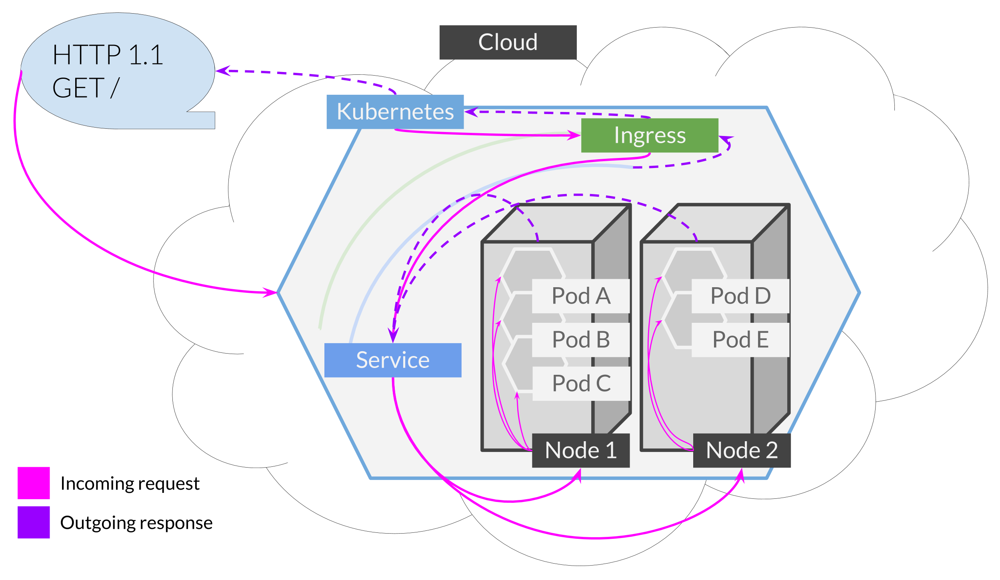

# Deploying Containers in Production
Welcome to the last section of the workshop!

In this section, we move on to a platform that is more commonly used to deploy containerised applications - Kubernetes. While Docker Swarm is a viable option today, most deployments are still done on Kubernetes because of its availability as enterprise options. Swarm also lacks certain essential features for container orchestration such as a readiness check mechanism.

Google has their [Google Kubernetes Engine](https://cloud.google.com/kubernetes-engine/) and Microsoft has the [Azure Kubernetes Service](https://azure.microsoft.com/en-us/services/kubernetes-service/). Amazon however, still uses a `docker-compose`ish methodology of deploying on its [Elastic Container Service](https://aws.amazon.com/ecs/) but has recently also launched its [Elastic Kubernetes Service](https://aws.amazon.com/eks/).

# Section Objectives
1. Understand various resource types in Kubernetes
2. Deploy a simple service in Kubernetes
3. Understand and use the Kubernetes Dashboard

# Kubernetes
Kubernetes is a batteries-included container orchestration platform.

## Kubernetes Manifest Types
### Deployment
A deployment manifest specifies the application. This includes details such as which container image to use, how many instances of the container should be run

## Kubernetes Resource Types
This is a short list of the possible resource types which we will be using in 

### Virtual Hardware
#### Clusters
Think of clusters as different clouds. They are disparate networks, and devices and subnets existing within each cluster cannot directly access the devices and subnets of another cluster.

Each cluster can accmodate a maximum number of nodes equal to its CIDR range. For example if you specified a CIDR range of 10.1.10.1/29, you would only be able to store 7 nodes in it:

1. 10.1.10.1
1. 10.1.10.2
1. 10.1.10.3
1. 10.1.10.4
1. 10.1.10.5
1. 10.1.10.6
1. 10.1.10.7

> **Note**: Cluster provisioning is outside the scope of this workshop, but if you are interested, you can search for `kops` and `kubeadm`.

#### Nodes
Nodes refer to the virtual machines within a cluster. Think of them as boxes of RAM and CPU through which various applications can be filled up into.

As an example, a node with 128 GB RAM and 32 CPUs, can fit in 128 pods that each request 1 GB RAM and 0.2 CPU. Even though there should be 6.4 virtual CPU units left, no more pods can be assigned to that node because there is insufficient RAM.

#### Pods
Pods are groups of one or more container instances. A pod is an atomic resource in Kubernetes and pods occupy nodes where RAM and CPU are available. You could think of these as sandboxed virtual machines within a high-powered physical box (the node in the Kubernetes context).

### Virtual Resources
#### ReplicaSet
ReplicaSet is short for replication set and this resource specifies details related to the application such as which container image to use, how many instances should be available, how the service rollout should happen *etc*.

#### Deployment
Deployments wrap around a RelicaSet and provides meta-data to identify the ReplicaSet as a whole instead of by individual pods generated from a ReplicaSet.

#### Service
Services expose a Deployment to the subnet which Kubernetes has created. Services define connection ports and link open ports on the Node to ports on the Deployment. There are a few ways of doing this such as NodePort and ClusterIP. We'll be using NodePort which means routing your application's port to a randomly assigned port on the Node. The Service then links this randomly assigned port to the Service's ID so that it can be acceesed by incoming requests.

Functionally, a Service acts as a reverse proxy to allow different Deployments to access each other by an ID defined in the Service manifest. A Service defined with the name `service-a` listening on port 5000 can access another Service defined with the name `service-b` listening on port 6000 by simply calling `service-b` to access it. The Service manifest defines the link between `service-b` and port 6000.

#### Ingress
An Ingress is functionally like a reverse proxy. It directs an incoming request to the correct application by translating the specified hostname into a Node's IP address and the port on the Node which links to the Service of interest. The Service's load balancer then distributes the request to the Pods of the Deployment.

## Summary

# Activity 1: Create and Deploy an Application
Click [here to go to the activity readme](./ACTIVITY-01.md).

# References & Further Reading
- [Official Kubernetes Reference](https://kubernetes.io/docs/reference/) (they have really good documentation)
- [Google Kubernetes Engine by Google](https://cloud.google.com/kubernetes-engine/)
- [Elastic Kubernetes Service by Amazon](https://aws.amazon.com/eks/)
- [Azure Kubernetes Service by Microsoft](https://azure.microsoft.com/en-us/services/kubernetes-service/)
- [Container Service for Kubernetes by Alibaba Cloud](https://www.alibabacloud.com/en/product/kubernetes)

- [Think before you use NodePort in Kubernetes](https://oteemo.com/2017/12/12/think-nodeport-kubernetes/)